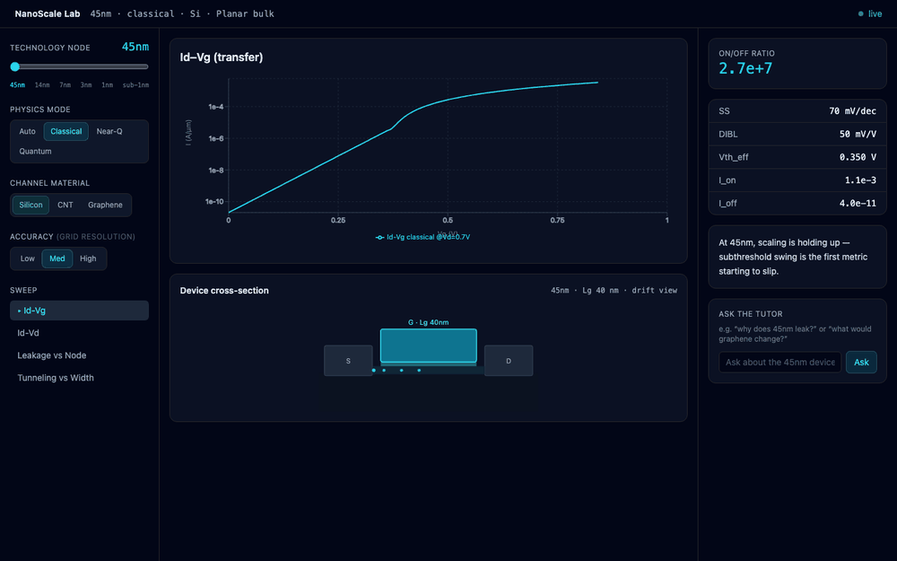

<div align="center">

# NanoScale Lab

### An interactive lab to explore the future — and the limits — of transistor scaling.

Watch a MOSFET evolve from **45 nm → 14 nm → 7 nm → 3 nm → 1 nm → sub‑1 nm**,
and *see* why smaller nodes work… and why they eventually fail.

## 🔴 [**▶ Try the live demo →**](https://jhakartik376.github.io/nanoscale-lab/)

<sub>Runs entirely in your browser — the physics engine is ported to TypeScript, so no install and no backend needed.</sub>

[](https://jhakartik376.github.io/nanoscale-lab/)
[](https://github.com/JhaKartik376/nanoscale-lab/actions/workflows/ci.yml)


<br/>



<sub>45 nm (clean switch) → 7 nm → 1 nm (quantum breakdown) → leakage → tunneling → graphene. Physics‑inspired, not TCAD.</sub>

<sub>Every view is a shareable deep‑link, e.g. <a href="https://jhakartik376.github.io/nanoscale-lab/?node=3nm&material=Graphene&sweep=idvg">?node=3nm&material=Graphene</a>.</sub>

</div>

---

## ✨ Why this exists

Every generation of chips packs transistors closer together. For decades that made them
faster and cheaper — then quantum mechanics started fighting back. **NanoScale Lab** turns that
story into something you can *play with*: drag a slider from 45 nm to sub‑1 nm and watch the
drive current, leakage, subthreshold slope, and on/off ratio evolve in real time, with a
plain‑English tutor explaining every number on screen.

> It's not a datasheet‑accurate simulator — it's a **learning + research exploration tool**
> built on physics‑inspired approximations chosen for conceptual clarity.

---

## 🔬 Three physics modes

| Mode | Nodes | What it models |
|------|-------|----------------|
| 🟦 **Classical** | 45–14 nm | 1‑D Poisson (finite‑difference, damped Newton) · drift‑diffusion · compact MOSFET (subthreshold → triode → saturation) |
| 🟨 **Near‑Quantum** | 7–3 nm | DIBL / short‑channel V<sub>th</sub> roll‑off · subthreshold‑swing degradation · sub‑threshold + gate‑tunneling leakage · density‑gradient quantum correction |
| 🟥 **Quantum‑Dominated** | 1 / sub‑1 nm | WKB tunneling · quantum‑well discrete levels (1/L²) · Landauer **ballistic** transport · on/off‑ratio collapse |

**The punchline:** as L<sub>g</sub> → ~5 nm, source‑drain tunneling lifts I<sub>off</sub> exponentially while
I<sub>on</sub> is pinned at its ballistic ceiling, so the on/off ratio collapses from **~10⁷ toward ~1** —
the device conducts whether you tell it to or not. That physics wall, not lithography, ends geometric scaling.

---

## 🧪 Multi‑material playground (Phase 7)

Swap the channel material and watch the trade‑offs — a great conductor is not the same as a great switch:

| Material | Mobility | Bandgap | @3 nm on/off | Verdict |
|----------|----------|---------|--------------|---------|
| **Silicon** | 1× | 1.12 eV | ~9.6 × 10³ | the baseline |
| **CNT** | 4× | 0.60 eV | ~3.0 × 10⁴ | more drive **and** still switches |
| **Graphene** | 10× | ~0 eV | **~22** | highest current, **can't switch off** (gapless) |

An **accuracy toggle** (low → high) trades speed for grid resolution.

---

## 🚀 Quick start

### 0 · Just try it — no install
👉 **[jhakartik376.github.io/nanoscale-lab](https://jhakartik376.github.io/nanoscale-lab/)** — the full simulator, physics running client‑side.

### 1 · Backend — FastAPI + NumPy/SciPy
```bash
cd backend
python3 -m venv .venv && source .venv/bin/activate
pip install -r requirements.txt
uvicorn main:app --reload --port 8000        # 📖 API docs: http://localhost:8000/docs
```

### 2 · Frontend — React + Vite + Tailwind
```bash
cd frontend
npm install
npm run dev                                  # 🌐 http://localhost:5173
```

### 3 · …or everything with Docker
```bash
docker compose up --build                    # frontend :5173 · backend :8000
```

### ✅ Verify the physics
```bash
cd backend
python physics/classical_model.py     # Poisson Vbi = 0.8334 V · SS 70/75 mV/dec
python physics/quantum_correction.py  # leakage rises 10× from 7→3 nm
python physics/tunneling_model.py     # WKB · well levels · ballistic on/off
python tests/smoke_test.py            # 28 end-to-end endpoint checks → ALL PASS
```

---

## 🌍 Deploy your own (full-stack, with the AI tutor)

The [live demo](https://jhakartik376.github.io/nanoscale-lab/) runs **client-side** (physics in the browser, rule-based tutor). To run the **full stack** — the Python physics backend **+ the Claude-powered chat tutor** — deploy the single container to a free host:

[](https://render.com/deploy?repo=https://github.com/JhaKartik376/nanoscale-lab)

1. Click the button and connect this repo — Render reads `render.yaml` and builds the root `Dockerfile` (frontend + FastAPI, one service).
2. *(Optional)* add an `ANTHROPIC_API_KEY` env var to enable the Claude tutor; without it, the tutor falls back to the grounded rule engine.

Or run the exact same container locally:
```bash
docker build -t nanoscale-lab .
docker run -p 8000:8000 -e ANTHROPIC_API_KEY=sk-... nanoscale-lab   # http://localhost:8000
```

---

## 🔌 API

| Method | Route | Purpose |
|--------|-------|---------|
| `POST` | `/simulate` | run a sweep → `{ series, metrics, meta, insight }` |
| `GET`  | `/graph-data` | replay the last snapshot for `(node, mode, sweep, material)` |
| `GET`  | `/explain` | grounded rule‑based verdict + insights |
| `POST` | `/chat` | AI tutor grounded in the live numbers (falls back to the rule engine offline) |
| `GET`  | `/nodes`, `/health` | metadata |

```jsonc
// POST /simulate
{
  "node": "3nm",
  "mode": "near_quantum",          // classical | near_quantum | quantum  (omit for node default)
  "sweep": "idvg",                 // idvg | idvd | leakage | tunneling
  "material": "Graphene",          // Si | CNT | Graphene
  "accuracy": "high",              // low | medium | high
  "bias": { "vd": 0.7, "vg": 0.7 }
}
```

---

## 🏗️ Architecture

```
┌─────────────────────────────────────────────────────────────┐
│  React + Tailwind SPA (Vite)                                 │
│  node slider · mode toggle · material · accuracy · sweep     │
│  Recharts panels · SVG device view · tutor chat              │
└───────────────┬─────────────────────────────────────────────┘
                │  REST / JSON
┌───────────────▼─────────────────────────────────────────────┐
│  FastAPI  ·  /simulate /graph-data /explain /chat            │
│  ┌─────────────────┐  ┌──────────────────┐  ┌─────────────┐  │
│  │ computation_    │  │ physics engine   │  │ explanation │  │
│  │ engine (cache)  │──│ classical /      │  │ engine +    │  │
│  │                 │  │ quantum_corr /   │  │ chat tutor  │  │
│  │                 │  │ tunneling        │  │             │  │
│  └─────────────────┘  └──────────────────┘  └─────────────┘  │
└──────────────────────────────────────────────────────────────┘
```

Layering rule: `api/` → `services/` → `physics/`. The physics core is pure NumPy/SciPy
with **zero web dependencies**, so every model is swappable and independently testable.

```
nanoscale-lab/
├── backend/
│   ├── physics/     classical_model · quantum_correction · tunneling_model
│   ├── services/    physics_bridge · computation_engine · explanation_engine · chat
│   ├── api/         simulation_routes.py
│   ├── main.py  ·  node_params.py  ·  schemas.py  ·  tests/smoke_test.py
├── frontend/
│   └── src/  components/ · hooks/ · lib/  (React + TS + Tailwind + Recharts)
└── docker-compose.yml
```

---

## 🗺️ Roadmap

- [x] **Phase 1** — Classical MOSFET core (Poisson + drift‑diffusion + compact model)
- [x] **Phase 2** — Node scaling engine (45 nm → sub‑1 nm)
- [x] **Phase 3** — Leakage + short‑channel effects (DIBL, SS, gate tunneling)
- [x] **Phase 4** — Quantum effects (WKB tunneling, confinement, ballistic)
- [x] **Phase 5** — Visualization (React UI, live charts, device cross‑section)
- [x] **Phase 6** — AI explanation layer (grounded rule engine + chat tutor)
- [x] **Phase 7** — Multi‑material (CNT, graphene) + accuracy toggle

---

## 📚 References

- **S. M. Sze & K. K. Ng** — *Physics of Semiconductor Devices*, Wiley.
- **Y. Taur & T. H. Ning** — *Fundamentals of Modern VLSI Devices*, Cambridge.
- **S. Datta** — *Quantum Transport: Atom to Transistor*, Cambridge.
- **Dennard et al. (1974)** scaling · **Hisamoto/Hu** FinFET · **Salahuddin & Datta (2008)** negative‑capacitance · **Ionescu & Riel (2011)** tunnel‑FETs · **IRDS** roadmap.

> The node parameter table is **pedagogical**, not a PDK. Absolute currents are illustrative;
> node‑to‑node *trends* are faithful.

---

<div align="center">
<sub>Built as a conceptual physics + full‑stack exploration. MIT licensed — learn, fork, extend.</sub>
</div>
